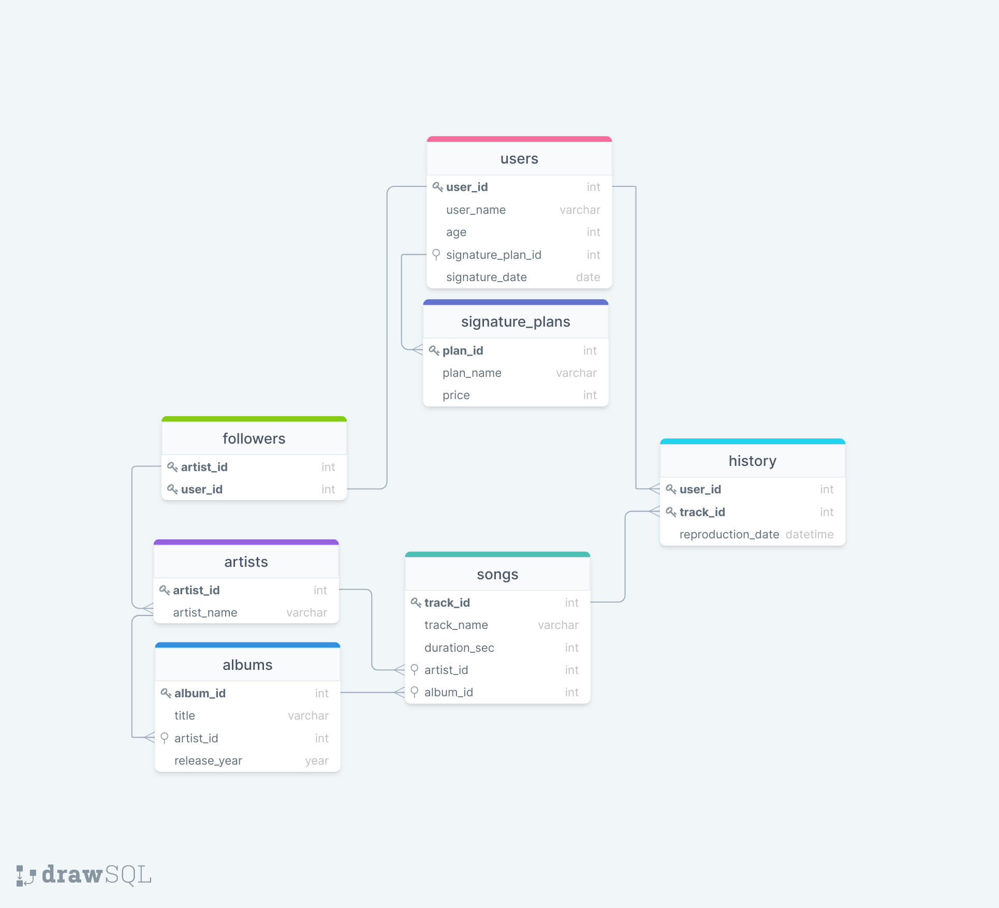

# One For All
> Projeto realizado durante o curso de Desenvolvimento Web da Trybe utilizando 
## :dart: Desafio do projeto: 
Através de uma tabela não normalizada semelhante ao que poderia ser uma versão simplificada do banco de dados do Spotify.
- Normalize a tabela [SpotifyClone](SpotifyClone-Non-NormalizedTable.xlsx) na terceira forma normal, crie o schema no seu banco de dados local e acesse as informações desta tabela através de `queries` utilizando `SQL`.
- Realize os desafios no seu banco normalizado e populado.

🗓 Data de entrega para avaliação final do projeto: `01/08/2022 14:00`.

#### Diagrama da [Tabela Normalizada](data/SpotifyClone-NormalizedTable.xlsx):

##### Utilizando Google Sheets e DrawSQL
#
## 📝 Checklist
> * [x]  **Crie um banco com o nome de SpotifyClone.**
>   
>   * Providencie as queries necessárias para criar tabelas normalizadas que atendam aos requisitos descritos na seção anterior;
>   * Providencie as queries necessárias para popular as tabelas conforme os dados listados na seção anterior;
>   * Crie um arquivo de configurações desafio1.json, que mapeará em qual tabela e coluna se encontram as informações necessárias para a avaliação.
> * [x]  **Crie uma QUERY que exiba três colunas:**
>   
>   * A primeira coluna deve exibir a quantidade total de canções. Dê a essa coluna o alias "cancoes".
>   * A segunda coluna deve exibir a quantidade total de artistas e deverá ter o alias "artistas".
>   * A terceira coluna deve exibir a quantidade de álbuns e deverá ter o alias "albuns".
> * [x]  **Crie uma QUERY que deverá ter apenas três colunas:**
>   
>   * A primeira coluna deve possuir o alias "usuario" e exibir o nome da pessoa usuária.
>   * A segunda coluna deve possuir o alias "qtde_musicas_ouvidas" e exibir a quantidade de músicas ouvida pela pessoa com base no seu histórico de reprodução.
>   * A terceira coluna deve possuir o alias "total_minutos" e exibir a soma dos minutos ouvidos pela pessoa usuária com base no seu histórico de reprodução.
>   * Os resultados devem estar agrupados pelo nome da pessoa usuária e ordenados em ordem alfabética.
> * [x]  **Crie uma QUERY que deve mostrar as pessoas usuárias que estavam ativas no ano de 2021 se baseando na data mais recente no histórico de reprodução.**
>   
>   * A primeira coluna deve possuir o alias "usuario" e exibir o nome da pessoa usuária.
>   * A segunda coluna deve ter o alias "condicao_usuario" e exibir se a pessoa usuária está ativa ou inativa.
>   * O resultado deve estar ordenado em ordem alfabética.
> * [x]  **Crie uma QUERY que possua duas colunas:**
>   
>   * A primeira coluna deve possuir o alias "cancao" e exibir o nome da canção.
>   * A segunda coluna deve possuir o alias "reproducoes" e exibir a quantidade de pessoas que já escutaram a canção em questão.
>   * Seu resultado deve estar ordenado em ordem decrescente, baseando-se no número de reproduções. Em caso de empate, ordene os resultados pelo nome da canção em ordem alfabética. Queremos apenas o top 2 de músicas mais tocadas.
> * [x]  **Crie uma QUERY que deve exibir quatro dados:**
>   
>   * A primeira coluna deve ter o alias "faturamento_minimo" e exibir o menor valor de plano existente para uma pessoa usuária.
>   * A segunda coluna deve ter o alias "faturamento_maximo" e exibir o maior valor de plano existente para uma pessoa usuária.
>   * A terceira coluna deve ter o alias "faturamento_medio" e exibir o valor médio dos planos possuídos por pessoas usuárias até o momento.
>   * Por fim, a quarta coluna deve ter o alias "faturamento_total" e exibir o valor total obtido com os planos possuídos por pessoas usuárias.
>   * Para cada um desses dados, por se tratarem de valores monetários, deve-se arredondar o faturamento usando apenas duas casas decimais.
> * [x]  **Crie uma QUERY com as seguintes colunas:**
>   
>   * A primeira coluna deve exibir o nome da pessoa artista, com o alias "artista".
>   * A segunda coluna deve exibir o nome do álbum, com o alias "album".
>   * A terceira coluna deve exibir a quantidade de pessoas seguidoras que aquela pessoa artista possui e deve possuir o alias "seguidores".
>   * Seus resultados devem estar ordenados de forma decrescente, baseando-se no número de pessoas seguidoras. Em caso de empate no número de pessoas, ordene os resultados pelo nome da pessoa artista em ordem alfabética e caso há artistas com o mesmo nome, ordene os resultados pelo nome do álbum alfabeticamente.
> * [x]  **Crie uma QUERY que o retorno deve exibir as seguintes colunas:**
>   
>   * O nome da pessoa artista, com o alias "artista".
>   * O nome do álbum, com o alias "album".
>   * Os resultados devem ser ordenados pelo nome do álbum em ordem alfabética.
> * [x]  **Crie uma QUERY que exibe a quantidade de músicas que estão presentes atualmente no histórico de reprodução de uma pessoa usuária específica.**
>   
>   * Quantas músicas estão no histórico do usuário "Bill" e a consulta deve retornar a seguinte coluna:
>     
>     * O valor da quantidade, com o alias "quantidade_musicas_no_historico".
> * [x]  **Crie uma QUERY que exiba o nome e a quantidade de vezes que cada canção foi tocada por pessoas usuárias do plano gratuito ou pessoal conforme os detalhes a seguir:**
>   
>   * A primeira coluna deve exibir o nome da canção, com o alias "nome";
>   * A segunda coluna deve exibir a quantidade de pessoas que já escutaram aquela canção, com o alias "reproducoes";
>   * Seus resultados devem estar agrupados pelo nome da canção e ordenados em ordem alfabética.
> 
> **BÔNUS**
> 
> * [x]  **Crie uma QUERY que altere o nome de algumas músicas e as ordene em ordem alfabética com as colunas abaixo se baseando nos seguintes critérios:**
>   
>   * O nome da música em seu estado normal com o alias nome_musica
>   * O nome da música atualizado com o alias novo_nome
> 
> _Critérios_
> 
> * Trocar a palavra "Streets" no final do nome de uma música por "Code Review"
> * Trocar a palavra "Her Own" no final do nome de uma música por "Trybe"
> * Trocar a palavra "Inner Fire" no final do nome de uma música por "Project"
> * Trocar a palavra "Silly" no final do nome de uma música por "Nice"
> * Trocar a palavra "Circus" no final do nome de uma música por "Pull Request"
